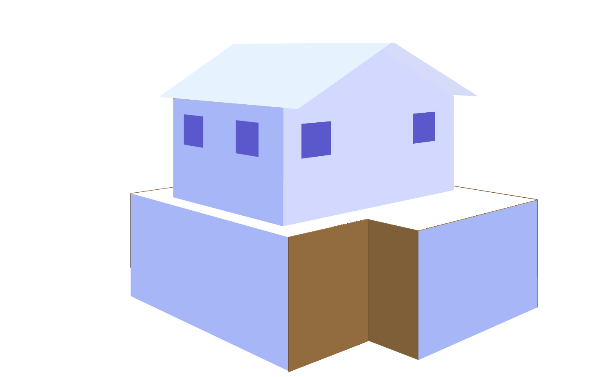
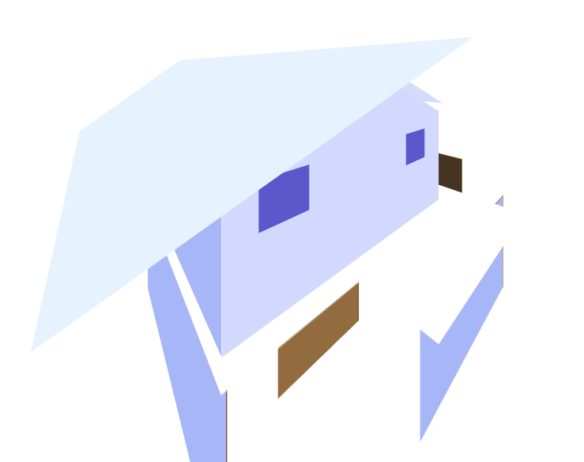

# Project CSS only FireWorks :fireworks:

_Shields that represent my project - They change over time._

      

## FireWorks Concept Design :pencil2:

<!-- PICTURE OF THE PRODUCT -->

## Live Demo :clapper:

See the pure CSS firworks in action here!:
[Link to DEMO](https://tristanvarewijck.github.io/FireWorks/)

---

## Description :label:

For the project CSS to the Resque it was my mission to make a firework show with Vanilla **CSS** and **HTML** ONLY, So the use of Javascript is not an option. The project is 3 firework shows made with only CSS, You can switch firework shows with tabs.

---

## ToDoList

In addition from how it now looks, i still want to update the background of the firework shows, so you can see shows in different areas. I also want to upgrade the firework shows.

- [ ] Background Art
- [ ] Make 1 more show
- [ ] Make flying flares

## Proces

### Week 1

In de eerste week had ik super veel zin om aan de slag te gaan met CSS, ik wilde voor dit project in eerste instantie werken met 3D objecten. Ik had hiervoor een goede tutorial gevonden die ik wilde gaan volgen. Hier ben ik mee aan de slag gegaan.

Gekozen onderdeel: "**Stijlvast Bedieningspaneel**" <br>
Tutorial: <br>
(https://medium.com/@annychuks07/how-to-create-a-3d-art-model-with-css3-555a7f0056ed)[https://medium.com/@annychuks07/how-to-create-a-3d-art-model-with-css3-555a7f0056ed]

### Week 2

In week twee was ik nog steeds bezig met de turotial met de 3D objecten het was ook aardig gelukt om via de tutorial een 3D huis neer te zetten. Helaas kwam ik erachter dat ik de code die is geschreven zelf niet helemaal goed begreep en dat ik niet het gewenste resultaat uit de tutorial heb gehaald. Ik heb daarom besloten om aan het eind van deze week een nieuw concept te beginnen.

Huisje met 2000px perspective: <br>
 <br>

Huisje met 1000px perspective: <br>


### Week 3

In week 3 ben heb ik een nieuw concept gekozen en heb ik besloten om met de vuurwerk opdracht aan de slag te gaan. Ik had mijn vorige concept uit het raam gegooit en ben meteen begonnen met het nieuwe concept. Ik ben begonnen met de interactie, ik wil namelijk 3 vuurwerk shows laten zien en dat de gebruiker kan kiezen tussen deze 3.
In deze week had ik de interactie en 1 vuurwerk show al afgekregen dus het zag er goed uit!

Gekozen onderdeel: "**Magische vuurwerkshow**"

### Week 4

In week 4 ging ik me focussen om nog 2 vuurwerk variaties te maken dit is niet gelukt, omdat ik er gewoon weg niet genoeg tijd voor had.. Het is me gelukt om nog 1 extra voorwerk show af te krijgen.

Zie de vuurwerk shows: (https://tristanvarewijck.github.io/FireWorks/)[https://tristanvarewijck.github.io/FireWorks/]

## Conclusie

Ik denk dat ik te snel van stapel ben gelopen om direct te beginnen met 3D objecten temaken terwijl ik er niet veel afwist. Wel heb ik veel geleerd doordat ik veel nieuwe css properties heb leren kennen.

## Code snippets

1. Voor het positioneren van mijn vuurwerk moest ik met de exacte pixels werken hiervoor heb ik een codesnippet gebruikt: https://codepen.io/yshlin/pen/WNMmQX

```
box-shadow: 226px -325.6666666667px #ea2027,
      -208px -177.6666666667px #ea2027, -113px -220.6666666667px #ea2027,
      -64px -20.6666666667px #ea2027, 203px -202.6666666667px #ea2027,
      -12px -161.6666666667px #ea2027, 138px -232.6666666667px #ea2027,
      -249px -148.6666666667px #ea2027, -42px -286.6666666667px #ea2027,
      -5px -0.6666666667px #ea2027, 173px 6.3333333333px #ea2027,
      -44px -165.6666666667px #ea2027, -40px 2.3333333333px #ea2027,
      182px -276.6666666667px #ea2027, 108px -151.6666666667px #ea2027,
      79px -89.6666666667px #ea2027, 122px -241.6666666667px #ea2027,
      211px 38.3333333333px #ea2027, -47px -147.6666666667px #ea2027,
      -226px -118.6666666667px #ea2027, -37px -373.6666666667px #ea2027,
      204px -118.6666666667px #ea2027, 137px -63.6666666667px #ea2027,
      62px -49.6666666667px #ea2027, 14px -11.6666666667px #ea2027,
      -222px -170.6666666667px #ea2027, -115px -163.6666666667px #ea2027,
      223px -32.6666666667px #ea2027, -152px -49.6666666667px #ea2027,
      -192px -88.6666666667px #ea2027, -50px -197.6666666667px #ea2027,
      126px -29.6666666667px #ea2027, -142px -387.6666666667px #ea2027,
      213px -53.6666666667px #ea2027, -21px 35.3333333333px #ea2027,
      105px -366.6666666667px #ea2027, -94px 5.3333333333px #ea2027,
      163px -306.6666666667px #ea2027, 45px -238.6666666667px #ea2027,
      31px -314.6666666667px #ea2027, 176px -180.6666666667px #ea2027,
      241px -11.6666666667px #ea2027, 88px -23.6666666667px #ea2027,
      -61px -158.6666666667px #ea2027, -56px 22.3333333333px #ea2027,
      -214px -59.6666666667px #ea2027, 121px -298.6666666667px #ea2027,
      123px -206.6666666667px #ea2027, -247px -284.6666666667px #ea2027,
      -90px -310.6666666667px #ea2027, -116px -299.6666666667px #ea2027;
  }

```

2

Ik wilde graag als achtergrond een specifieke gradient color hebben, hiervoor heb ik een codesnippet gebruikt: https://codepen.io/bork/pen/WNrmWr

```
 background: #040b3c;
  background: -moz-linear-gradient(top, #040b3c 0%, #012459 100%);
  background: -webkit-gradient(
    linear,
    left top,
    left bottom,
    color-stop(0%, #040b3c),
    color-stop(100%, #012459)
  );
  background: -webkit-linear-gradient(top, #040b3c 0%, #012459 100%);
  background: -o-linear-gradient(top, #040b3c 0%, #012459 100%);
  background: -ms-linear-gradient(top, #040b3c 0%, #012459 100%);
  background: linear-gradient(to bottom, #040b3c 0%, #012459 100%);
  filter: progid:DXImageTransform.Microsoft.gradient( startColorstr='#040b3c', endColorstr='#012459',GradientType=0 );
```

## Meta

Tristan Varewijck <br>
:email: [Tristan.varewijck@gmail.com](Tristan.varewijck@gmail.com) ||
:large_blue_diamond: [https://www.linkedin.com/in/tristanvarewijck-1999/](https://www.linkedin.com/in/tristanvarewijck-1999/)


---

## License

Usage is provided under the [MIT License](https://github.com/git/git-scm.com/blob/master/MIT-LICENSE.txt) MIT. See [LICENSE](https://github.com/TristanVarewijck/FireWorks/blob/master/LICENSE) for the full details.
